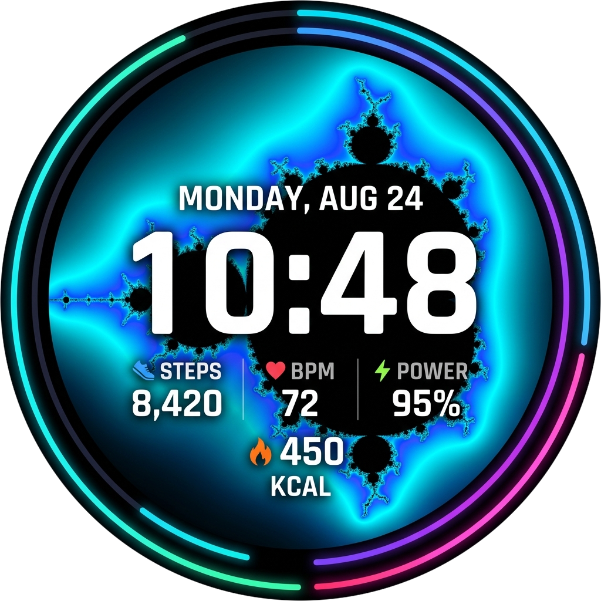
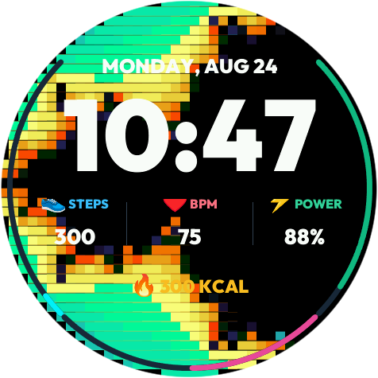
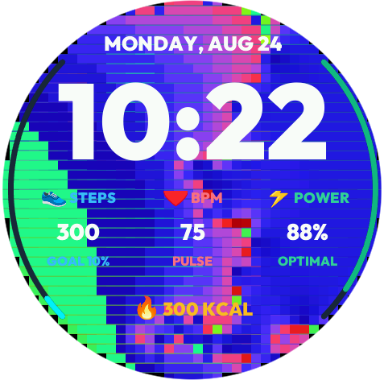
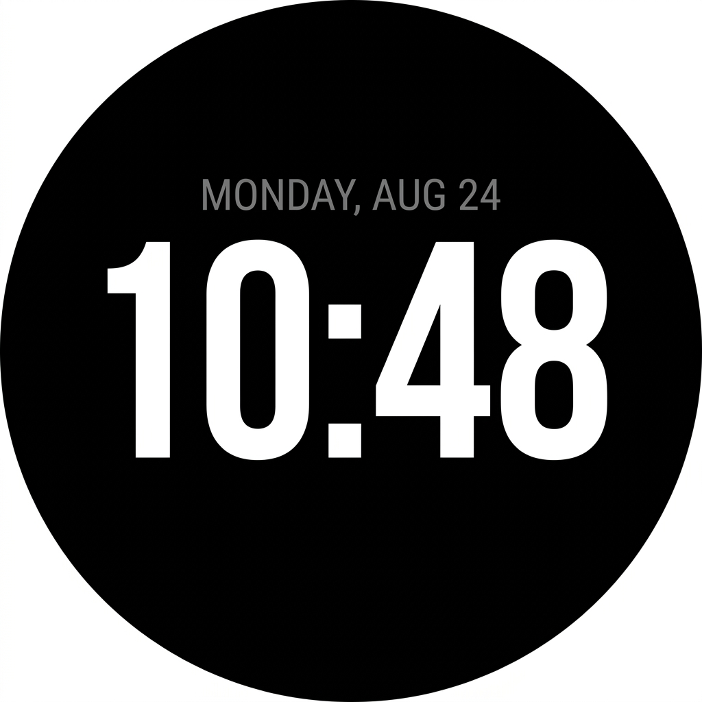

# Mandelbrot Fractal Watchface for Amazfit Zepp OS

<p align="center">
  
</p>

<p align="center">
  A sleek, minimalist, feature-packed digital watchface built with <b>Zepp OS</b> (compatible with Zepp OS 2.0, 3.0, 3.5, and 4.0+) featuring real-time procedural Mandelbrot fractal zooming, ultra-bold typography, and a dedicated pure digital Always-On Display (AOD).
</p>

---

## 📸 Screenshots

<p align="center">
  
  &nbsp;&nbsp;
  
  &nbsp;&nbsp;
  
</p>

<p align="center">
  <b>Active Mode (Electric Cyan)</b> &nbsp;&nbsp;|&nbsp;&nbsp; <b>Deep Zoom (Cyber Magenta)</b> &nbsp;&nbsp;|&nbsp;&nbsp; <b>Always-On Display (AOD)</b>
</p>

---

## ✨ Features

- 🎯 **Round Display Optimized**:
  - Exclusively configured for circular Amazfit devices (`"st": "r"`, 480x480 resolution) compliant with Zepp Open Platform standards (Amazfit T-Rex 3, Balance, Cheetah, Active, GTR 4, etc.).

- 🌙 **Dedicated Pure Digital AOD (Always-On Display)**:
  - Automatically detected via `getScene() === SCENE_AOD`.
  - **Zero Animations & Zero Background**: Pure solid OLED black (`#000000`) background with no canvas drawing or fractal loops running, ensuring optimal power efficiency.
  - Displays large, centered, crisp white digital time (`HH:MM`) and subtle date header.
  - Reduced timer tick interval during AOD to protect battery life.

- 🔤 **Ultra-Bold Modern Typography**:
  - Direct overlay of **Outfit Black (900 Weight)** typography directly across the screen.
  - Punchy, heavy `126px` time digits with maximum glanceability.

- ⚡ **Hardware-Optimized Active Zoom Engine**:
  - Continuous potential shading guarantees **zero black or blank frames**.
  - Reduced native Canvas bridge calls by **>90%** (~100 line spans per frame) for fluid 1 Hz animation on physical watch hardware (<20ms per frame on watch MCU).
  - Rotates through 8 iconic landmarks each minute (*Electric Cardioid*, *Seahorse Valley*, *Triple Spiral*, *Elephant Valley*, *Mini-Brot Satellite*, *Starfish Galaxy*, *Feather Valley*, *Golden Spiral*).

- 🕒 **Digital Clock**: Large `HH:MM` display (no seconds) with 12h/24h format support.
- 📅 **Date & Day**: Full day of week and month calendar header (`MONDAY, AUG 24`).
- 👟 **Step Tracker**: Live step counter with daily goal progress and visual left-bezel arc.
- ⚡ **Battery Monitor**: Live battery percentage with power status and visual right-bezel dynamic color arc (Green / Amber / Red).
- ♥️ **Heart Rate Monitor**: Real-time heart rate sensor tracking in BPM.
- 🔥 **Calorie Burned**: Active daily calorie expenditure counter with bottom bezel arc.
- 🔄 **Lifecycle Safe**: Proper resource cleanup in `onDestroy` to prevent battery drain.

---

## 📁 Project Structure

```
├── app.json              # Zepp OS application configuration (Round platforms only)
├── app.js                # Global application lifecycle
├── watchface/
│   └── index.js          # Active watchface, AOD digital mode, Mandelbrot zoom engine
├── assets/               # Application icons, screenshots and custom fonts
│   ├── icon.png
│   ├── fonts/
│   │   ├── outfit-black.ttf  # Ultra-bold Outfit 900 typography
│   │   └── outfit.ttf
│   ├── screenshots/
│   │   ├── screenshot_1.png  # Active mode preview
│   │   ├── screenshot_2.png  # Deep zoom preview
│   │   └── screenshot_3.png  # Digital AOD preview
│   ├── default.r/
│   └── default.s/
├── dist/                 # Compiled Zepp Application Bundles (.zab)
├── package.json          # Project metadata and build scripts
├── LICENSE               # MIT License
└── README.md             # Project documentation
```

---

## 🚀 Getting Started

### Prerequisites

- **Node.js**: v18.0.0 or higher
- **Zeus CLI**: `@zeppos/zeus-cli` (`npm install -g @zeppos/zeus-cli`)

### Commands

#### 1. Build Production Package
```bash
zeus build
```

#### 2. Run Simulator (Development Mode)
```bash
zeus dev
```

#### 3. Preview on Physical Watch
```bash
zeus preview
```

---

## 📄 License

This project is licensed under the MIT License - see the [LICENSE](LICENSE) file for details.
